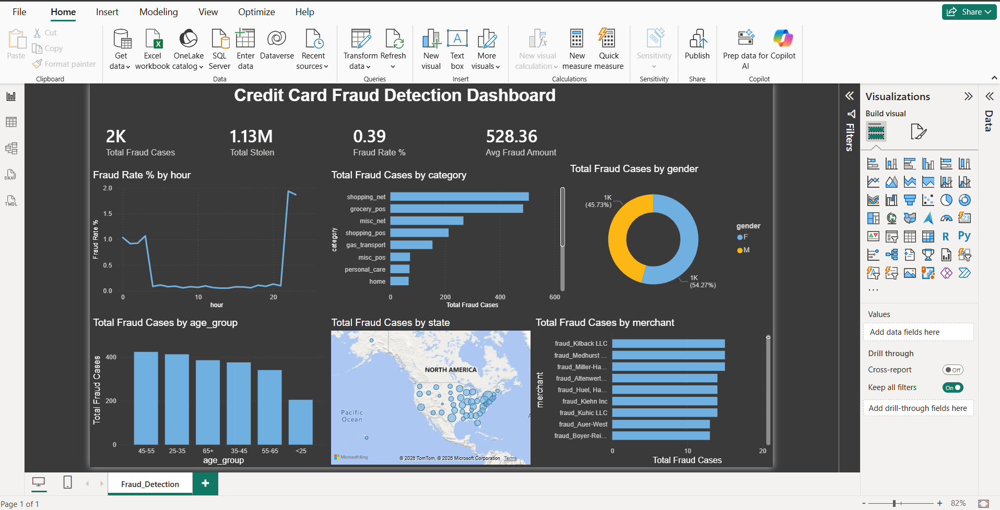

# 💳 Credit Card Fraud Detection


> **An end-to-end Data Analytics project** — from raw CSV to SQL database to an interactive Power BI dashboard — uncovering fraud patterns across 500K+ credit card transactions.

---

## 🖥️ Power BI Dashboard Preview



---

## 📌 Project Overview

Financial fraud costs businesses billions every year. In this project, I built a **complete data analytics pipeline** analyzing **555,719 credit card transactions** from Jan 2019 – Dec 2020.

### 🔧 Tech Stack Used
| Tool | Purpose |
|------|---------|
| Python (Pandas, Matplotlib, Seaborn) | Data cleaning, EDA, visualizations |
| MySQL | Data storage & SQL analysis |
| Power BI | Interactive dashboard |
| VS Code | Development environment |

---

## 📊 Dataset

- **Source:** [Kaggle – Credit Card Transactions Fraud Detection](https://www.kaggle.com/datasets/kartik2112/fraud-detection)
- **Rows:** 555,719 transactions
- **Period:** January 2019 – December 2020
- **Cardholders:** 1,000 simulated customers | 800 merchants
- **Key columns:** `trans_date_trans_time`, `merchant`, `category`, `amt`, `gender`, `city`, `state`, `job`, `dob`, `is_fraud`

---

## 🔍 Key Findings

| Metric | Value |
|--------|-------|
| 📦 Total Transactions | 5,55,719 |
| 🚨 Fraudulent Cases | 2,000+ |
| 📉 Fraud Rate | 0.39% |
| 💸 Total Amount Stolen | $1.13M |
| 💰 Avg Fraud Amount | $528.36 |

### 🏪 Riskiest Merchant Categories
`shopping_net` and `grocery_pos` had the highest fraud counts — online shopping is the #1 fraud vector.

### 🕛 When Does Fraud Happen?
Fraud spikes dramatically between **10 PM – 11 PM** — fraudsters operate at night.

### 👥 Who Gets Targeted?
- Age group **25-55** is the most targeted
- Gender split is nearly equal (F: 45.73% | M: 54.27%)

### 🌍 Fraud Hotspot States
New York (NY) and Texas (TX) lead in total fraud cases.

---

## 📁 Project Structure

```
credit-card-fraud-detection/
│
├── 📓 creditcard_fraud_detection.py   # Full Python EDA script
├── 🗄️ fraud_analysis.sql              # SQL analysis queries
├── 📊 screenshots/
│   ├── powerbi_dashboard.png          # Power BI dashboard
│   ├── fraud_by_hour.png
│   ├── fraud_by_category.png
│   ├── fraud_by_age.png
│   ├── fraud_by_gender.png
│   └── correlation_heatmap.png
└── 📄 README.md
```

---

## 🔄 Project Pipeline

```
Kaggle CSV
    ↓
Python (VS Code)
→ Data Cleaning
→ Feature Engineering (age, hour, day, age_group)
→ EDA + Visualizations (10+ charts)
    ↓
MySQL Database
→ 555,719 rows loaded via SQLAlchemy
→ 7 SQL analysis queries
    ↓
Power BI Dashboard
→ 4 KPI Cards
→ 7 Interactive Visuals
→ Dark Professional Theme
```

---

## 📈 Analysis Performed

### ✅ Python EDA
- Fintech Audit Report
- Fraud by Hour of Day
- Fraud by Day of Week
- Fraud by Merchant Category
- Fraud by Age Group
- Fraud by Gender
- Transaction Amount Distribution (Fraud vs Legit)
- Correlation Heatmap
- State-level Fraud Summary

### ✅ MySQL SQL Analysis
- Overall fraud audit query
- Fraud by category
- Fraud by hour
- Fraud by state (Top 10)
- Fraud by age group
- Fraud by gender
- Top 10 merchants by fraud

### ✅ Power BI Dashboard
- KPI Cards: Total Cases, Amount Stolen, Fraud Rate %, Avg Amount
- Line Chart: Fraud Rate by Hour
- Bar Chart: Fraud by Category
- Donut Chart: Fraud by Gender
- Column Chart: Fraud by Age Group
- Map Visual: Fraud by State
- Bar Chart: Top Merchants by Fraud

---

## 🚀 How to Run

**1. Clone the repository:**
```bash
git clone https://github.com/your-username/credit-card-fraud-detection.git
```

**2. Download the dataset from Kaggle:**
```
https://www.kaggle.com/datasets/kartik2112/fraud-detection
```

**3. Install dependencies:**
```bash
pip install pandas numpy matplotlib seaborn sqlalchemy pymysql cryptography
```

**4. Run the Python script:**
```bash
python creditcard_fraud_detection.py
```

**5. Set up MySQL:**
- Create database `fraud_detection`
- Run `fraud_analysis.sql` in MySQL Workbench

**6. Open Power BI:**
- Connect to MySQL (`127.0.0.1`, `fraud_detection`)
- Load `transactions` table

---

## 💡 Skills Demonstrated

- ✅ Data Cleaning & Feature Engineering
- ✅ Exploratory Data Analysis (EDA)
- ✅ Python (Pandas, Matplotlib, Seaborn)
- ✅ SQL (MySQL — aggregations, filtering, grouping)
- ✅ Power BI (DAX measures, interactive dashboard)
- ✅ End-to-end project pipeline
- ✅ Business insight extraction from raw data

---

## 🤝 Connect with Me

- 💼 [LinkedIn](https://linkedin.com/in/ankith-k-367462219)
- 📧 ankithsingh137@gmail.com

---

